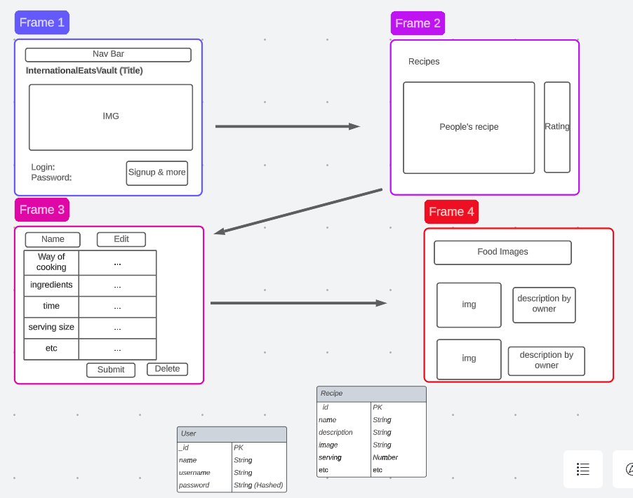

# International Eats Vault

## Introduction

International Eats Vault is a web-based recipe book application designed for users to explore, share, and manage a variety of international recipes. It allows users to sign up, log in, and interact with a collection of culinary delights from around the world.

## Wireframe

## Technologies
* Node.js
* Express
* MongoDB
* bcrypt for authentication
* EJS for templating
* CSS for styling
* Method-Override for HTTP verb flexibility

## Features

* User authentication with secure login and signup
* Ability to view, create, edit, and delete recipes
* Organized display of recipes with detailed information
* Interactive and user-friendly web interface

## Installation

To install and run this project:

1. Clone the repository:

git clone https://github.com/rlacerna/International-Eats-Vault-Project.git

2. Navigate to the project directory:

cd International-Eats-Vault

3. Install the necessary dependencies:

npm install

4. Start the server:

npm start

5. Access the application through http://localhost:3000 in your browser.

## Configuration

* Make sure to set up your MongoDB database and connect it using the DATABASE_URL in your .env file.
* Configure the session secret in the .env file for secure user sessions.

## Usage

After launching the application, users can:

* Sign up for a new account or log in with existing credentials.
* View the list of recipes on the home page.
* Create new recipes by filling out a form with details like name, description, ingredients, and preparation steps.
* Edit or delete existing recipes.

## Contributing

Contributions to the project are welcome! Follow these steps to contribute:

1. Fork the repository.
2. Create a new branch: git checkout -b <branch_name>.
3. Make your changes and commit them: git commit -m '<commit_message>'.
4. Push to the original branch: git push origin <project_name>/<location>.
5. Create a pull request.

## Contact
For any questions or suggestions, feel free to reach out at renzlacerna13@gmail.com 